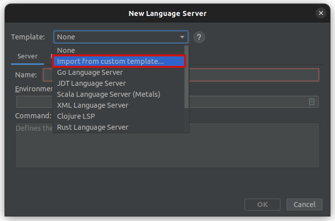
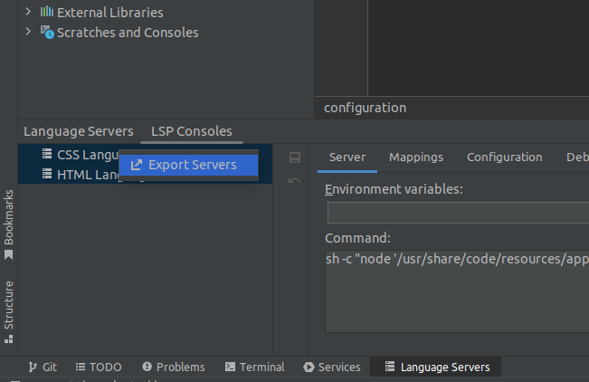

# User-defined language server

LSP4IJ provides the capability to consume any language server without developing
an IntelliJ plugin via a `User-defined language server`.

The main idea is to: 

 * install the language server and its requirements(ex : `Node.js` to 
execute a language server written in JavaScript/TypeScript), 
 * declare the command which starts the language server.
 * associate the language server with the proper files (identified by IntelliJ Language, File Type or file name pattern)

## New Language Server dialog

To create a new `User-defined language server` you need to open the `New Language Server` dialog, either:

 * from the menu on the right of the LSP console:

* or with the `[+]` on the top of the language server settings:

Once you clicked on either of them, the dialog will appear:

### Server tab

The `Server tab` requires to fill the `server name` and the `command` which will start the language server.

Here is a sample with the [typescript-language-server](https://github.com/typescript-language-server/typescript-language-server):

#### Environment variables

The environment variables accessible by the process are populated with 
[EnvironmentUtil.getEnvironmentMap()](https://github.com/JetBrains/intellij-community/blob/3a527a2c9b56209c09852ba7bc89d80bc31e1c04/platform/util/src/com/intellij/util/EnvironmentUtil.java#L85) 
which retrieves system variables.

It is possible too to add custom environment variables via the field `Environment variables`:

Depending on your OS, the environment variables may not be accessible. To make sure they are accessible, you can fill out the order fields:

* with `Windows OS`: `cmd /c command_to_start_your_ls`
* with `Linux`, `Mac OS`: `sh -c command_to_start_your_ls`

### Mappings tab

The `Mappings tab` provides the capability to `associate the language server with the proper files` identified by: 

 * [IntelliJ  Language](https://plugins.jetbrains.com/docs/intellij/custom-language-support.html) 
 * [IntelliJ File type](https://www.jetbrains.com/help/idea/creating-and-registering-file-types.html) 
 * `File name pattern`

Here are mappings samples with the [typescript-language-server](https://github.com/typescript-language-server/typescript-language-server):

 * The existing `JavaScript` file type is used to associate the file to the language server: 

* Since IntelliJ (Community) doesn't provide file type by default `TypeScript`, `React` file name patterns are used:

NOTE: it is better to use file name pattern instead of creating custom file type for TypeScript, since by default 
IntelliJ Community support `TypeScript syntax coloration` with `TextMate`. If you define a file type, you will
lose syntax coloration.

### Configuration tab

The `Configuration tab` allows to configure the language server with the expected (generally JSON format) configuration. 

Here are configuration sample with the [typescript-language-server](https://github.com/typescript-language-server/typescript-language-server):

### Debug tab

The `Debug tab` is available when you have created the language server definition. It allows to customize the 
level Trace used in LSP console.

### Using template
Template can be used to quickly create user defined language server pre-filled 
with server name, command, mappings and potential configurations.

#### Default template
The `Template combo-box` provides some default language servers templates (located in templates directory classpath), 
pre-filled with server name, command, mappings and potential configuration.

If the template folder contains a `README.md` file, you can press the help button to open the instructions.

* [Clojure LSP](./user-defined-ls/clojure-lsp.md)
* [CSS Language Server](./user-defined-ls/vscode-css-language-server.md)
* [Go Language Server](./user-defined-ls/gopls.md)
* [HTML Language Server](./user-defined-ls/vscode-html-language-server.md)
* [Scala Language Server (Metals)](./user-defined-ls/metals.md)
* [TypeScript Language Server](./user-defined-ls/typescript-language-server.md)

#### Custom template

The `Template file-selector` can be used to select a directory from the file system to load a custom language server template, 
these templates can be pre-filled with server name, command, mappings and potential configuration.

If the template folder contains a `README.md` file, you can press the help button to open the instructions.

### Exporting templates

Users can also export their own language servers to a zip file. This can be done from the LSP console, 
by selecting one or more language servers and selecting the export option from the context menu.

The created zip file contains a separate folder for each language server that can be used as a template 
when creating a new language servers.

Each folder contains the following files:
- `template.json`
- `settings.json`
- `initializationOptions.json`

You can also manually add a `README.md` file to the folder to provide instructions for the language server.
